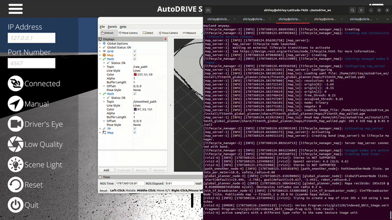
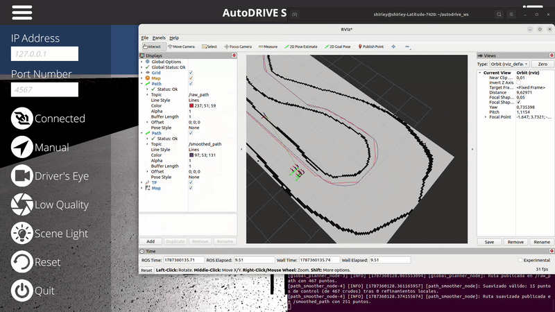
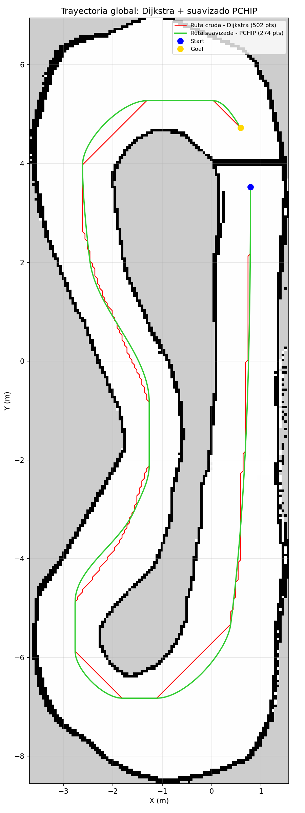

# F1TENTH Global Path Planner (Dijkstra + PCHIP) & PID Trajectory Tracking — AutoDRIVE Simulator

Proyecto de Mapeo, Planificación Global y Control de Trayectorias, desarrollado sobre el
simulador **AutoDRIVE** (F1TENTH) usando **ROS 2 (Humble)**. El sistema:

1. Construye un mapa 2D del entorno mediante **SLAM Toolbox** (Parte A).
2. Planifica una ruta global entre un punto de inicio y una meta usando **Dijkstra**, y la
   suaviza con un **spline PCHIP** (shape-preserving) para obtener una curva continua y
   cinemáticamente viable (Parte B — paquete [`f1tenth_global_planner`](src/f1tenth_global_planner/)).
3. Sigue esa trayectoria de forma autónoma en el simulador mediante un **controlador de
   seguimiento de trayectoria** (Pure Pursuit para dirección + PID para velocidad), que además
   **cierra la ruta en un circuito continuo** para poder dar vueltas indefinidas, compensa la
   latencia de la pose y lleva conteo de vueltas con cronómetro (Parte C — paquete
   [`f1tenth_pid_controller`](src/f1tenth_pid_controller/)).

## 🎥 Demostraciones Visuales

📺 **[Generación de mapa con SLAM](https://www.youtube.com/watch?v=9VNgWsDzoU8)**

📺 **[Movimiento del auto en AutoDRIVE sobre el mapa y trayectoria generada](https://www.youtube.com/watch?v=JdyhFhaaJMo)**

📺 **[Control autónomo (PID) — 10 vueltas consecutivas sin colisión](PENDIENTE_ENLACE)**
> **Prueba 1 (estabilidad):** el video muestra al vehículo recorriendo el circuito de forma
> autónoma durante 10 vueltas consecutivas sin colisionar, junto con la terminal donde se
> imprime el contador de vueltas y el tiempo de cada vuelta.

📺 **Vuelta más rápida (Prueba 2): pendiente de enlace.**
> **Prueba 2 (velocidad):** intento de vuelta rápida con el perfil de velocidad más agresivo.

### Resultados obtenidos

| Prueba | Métrica | Resultado |
|---|---|---|
| 1 — Estabilidad | 10 vueltas consecutivas sin colisión | PENDIENTE: completar |
| 1 — Estabilidad | Tiempo medio por vuelta | ~35–40 s (`base_speed = 1.1`) |
| 2 — Vuelta rápida | Mejor vuelta | PENDIENTE: completar |

> Los tiempos se leen directamente de la terminal del controlador, que imprime una línea por
> vuelta completada (ver [Opción C](#opción-c--demo-completa-con-conducción-autónoma-dijkstra--pchip--pid)).

A continuación, se observa el funcionamiento de los algoritmos:

**Generación de la trayectoria mediante Dijkstra:**


**Comparación visual: Ruta cruda (Dijkstra) vs. Ruta suavizada (PCHIP):**


**Trayectoria final (mapa + waypoints crudos y suavizados superpuestos):**


> **Nota:** Se cambiaron los puntos de start y goal con respecto a la primera parte con el objetivo de que coincida con el punto real de arranque.

## 📂 Estructura del repositorio

```text
.
├── docs/
│   ├── debug_images/            # Capturas de diagnóstico usadas durante el desarrollo
│   └── media/                   # GIFs, imagen de trayectoria final y recursos multimedia del README
├── waypoints/                    # Waypoints generados (CSV) de la ruta cruda y suavizada
│   ├── raw_path.csv
│   └── smoothed_path.csv
├── scripts/                     # Herramientas de desarrollo (no forman parte de ningún paquete ROS2)
│   ├── visualize_map.py         # Visualiza el mapa (.pgm/.yaml) con grilla de coordenadas del mundo
│   ├── pick_start_goal.py       # Elige visualmente start/goal haciendo clic sobre el mapa inflado
│   └── plot_waypoints.py        # Genera la imagen final (mapa + waypoints crudos y suavizados)
└── src/
    ├── f1tenth_global_planner/  # Paquete ROS2 (ament_python) — Parte A y B
    │   ├── f1tenth_global_planner/
    │   │   ├── global_planner_node.py     # Dijkstra (con centrado de carril) sobre el OccupancyGrid inflado
    │   │   ├── path_smoother_node.py      # Simplificación (Douglas-Peucker) + spline PCHIP
    │   │   └── sim_tf_broadcaster_node.py # Publica TF map->f1tenth_1 (ips + imu del simulador)
    │   ├── launch/
    │   │   ├── map_launch.py         # Solo mapa (map_server + lifecycle_manager)
    │   │   ├── planning_launch.py    # Mapa + Dijkstra + suavizado + RViz
    │   │   └── demo_launch.py        # Pipeline completo + TF broadcaster (para grabar con el simulador)
    │   ├── maps/
    │   │   ├── F1tenth_Map.{pgm,yaml}         # Mapa crudo generado con SLAM Toolbox
    │   │   └── F1tenth_Map_walled.{pgm,yaml}  # Copia con una "pared virtual" (ver explicación abajo)
    │   ├── config/
    │   │   └── mapper_params_online_async.yaml  # Parámetros de SLAM Toolbox usados para el mapeo
    │   ├── package.xml
    │   └── setup.py
    └── f1tenth_pid_controller/  # Paquete ROS2 (ament_python) — Parte C
        ├── f1tenth_pid_controller/
        │   └── pid_controller_node.py   # Control (Pure Pursuit + PID de velocidad), cierre de
        │                                # circuito, compensación de latencia, vueltas y cronómetro
        ├── launch/
        │   └── pid_control_launch.py    # Lanza el nodo; resuelve la ruta del CSV de waypoints
        ├── config/
        │   └── pid_params.yaml          # Parámetros de control y ejecución
        ├── package.xml
        └── setup.py
```

## 🔧 Dependencias

Probado en **Ubuntu 22.04 + ROS 2 Humble**.

| Paquete | Notas |
|---|---|
| `ros-humble-desktop` | Instalación base de ROS 2 |
| `ros-humble-nav2-map-server` | Sirve el mapa como `OccupancyGrid` |
| `ros-humble-nav2-lifecycle-manager` | Activa `map_server` automáticamente |
| `ros-humble-slam-toolbox` | Usado en la etapa de mapeo (Parte A) |
| `ros-humble-tf2-ros`, `ros-humble-tf2-geometry-msgs` | Usados por `sim_tf_broadcaster_node` y `pid_controller_node` (Parte C) |
| `python3-numpy`, `python3-scipy` | Dijkstra, transformada de distancia, interpolación PCHIP |
| `python3-matplotlib`, `python3-pillow`, `python3-yaml` | Solo para los scripts de `scripts/` (no se instalan con los paquetes ROS2) |
| [AutoDRIVE Simulator + `autodrive_ros2`](https://github.com/Tinker-Twins/AutoDRIVE) | Simulador y bridge ROS2 (ver instrucciones oficiales del devkit) |

Instalación rápida de dependencias de sistema:

```bash
sudo apt update
sudo apt install ros-humble-nav2-map-server ros-humble-nav2-lifecycle-manager \
                 ros-humble-slam-toolbox ros-humble-rviz2 \
                 ros-humble-tf2-ros ros-humble-tf2-geometry-msgs

pip3 install numpy scipy matplotlib pillow pyyaml --user
# Si tu Ubuntu da error de "externally managed environment":
# pip3 install numpy scipy matplotlib pillow pyyaml --break-system-packages
```

## 🚀 Instalación

1. Clona este repositorio dentro del `src/` de tu workspace de ROS 2 (o usa symlinks, como
   se hizo durante el desarrollo):

   ```bash
   cd ~/autodrive_ws/src
   git clone https://github.com/shirleyandrea052004-sketch/f1tenth-dijkstra-global-planner.git
   ln -s ~/f1tenth-dijkstra-global-planner/src/f1tenth_global_planner f1tenth_global_planner
   ln -s ~/f1tenth-dijkstra-global-planner/src/f1tenth_pid_controller f1tenth_pid_controller
   ```

   *(Alternativa sin symlink: copia directamente `f1tenth-dijkstra-global-planner/src/f1tenth_global_planner`
   y `f1tenth-dijkstra-global-planner/src/f1tenth_pid_controller` a `~/autodrive_ws/src/`).*

2. Compila ambos paquetes:

   ```bash
   cd ~/autodrive_ws
   colcon build --packages-select f1tenth_global_planner f1tenth_pid_controller --symlink-install
   source install/setup.bash
   ```

   > ⚠️ **`source install/setup.bash` hay que ejecutarlo en CADA terminal nueva** que vaya a
   > usar estos paquetes. Es la causa más común de `package not found`. Para no repetirlo:
   > ```bash
   > echo "source ~/autodrive_ws/install/setup.bash" >> ~/.bashrc
   > ```
   > Ten en cuenta que `--symlink-install` enlaza el código Python (los cambios en los `.py`
   > se ven al relanzar), pero **los archivos de configuración YAML sí requieren recompilar**.

## ▶️ Uso

### Opción A — Solo planificación (mapa estático, sin simulador)

Prueba rápida de Dijkstra + suavizado sobre el mapa guardado, sin necesidad de levantar
AutoDRIVE:

```bash
ros2 launch f1tenth_global_planner planning_launch.py
```

Esto levanta `map_server` (con la "pared virtual", ver más abajo), el nodo de Dijkstra, el
nodo de suavizado, y RViz. En RViz, agrega manualmente (si no aparecen ya en la config):

- **Map** → topic `/map`
- **Path** → topic `/raw_path` (ruta cruda de Dijkstra)
- **Path** → topic `/smoothed_path` (ruta suavizada)

Puedes disparar una nueva planificación en cualquier momento usando la herramienta
**"2D Nav Goal"** de la barra superior de RViz y haciendo clic sobre el mapa.

### Opción B — Planificación + simulador (sin control autónomo)

1. Levanta el simulador Unity:
   ```bash
   cd ~/Downloads/AutoDRIVE_Sim
   ./"AutoDRIVE Simulator.x86_64"
   ```
2. Levanta el bridge ROS2:
   ```bash
   cd ~/autodrive_ws
   source install/setup.bash
   ros2 launch autodrive_f1tenth simulator_bringup_rviz.launch.py
   ```
3. Levanta el pipeline de planificación + suavizado + TF del vehículo (nueva terminal,
   recuerda sourcear):
   ```bash
   cd ~/autodrive_ws && source install/setup.bash
   ros2 launch f1tenth_global_planner demo_launch.py
   ```
4. (Opcional) Mueve el vehículo con teleoperación para ver el `Path` alineado con su
   posición real:
   ```bash
   ros2 run autodrive_f1tenth teleop_keyboard
   ```

En el RViz que abre `demo_launch.py`, agrega el display **TF** (By display type → TF) para ver
el frame `f1tenth_1` (posición real del vehículo en el simulador) moviéndose sobre el mapa y
el `Path` planificado.

### Opción C — Demo completa con conducción autónoma (Dijkstra + PCHIP + PID)

> ⚠️ **Sourcear en CADA terminal.** Cada uno de los pasos siguientes se ejecuta en una
> terminal distinta, y **todas** necesitan el entorno cargado antes de cualquier comando:
> ```bash
> cd ~/autodrive_ws
> source install/setup.bash
> ```
> Si un `ros2 launch` responde *"package not found"*, casi siempre es que faltó este paso.

Este es el flujo recomendado para las pruebas de competencia. La diferencia clave frente a la
Opción B es que **el pipeline de planificación se apaga una vez generada la ruta**, y solo se
deja vivo el nodo que publica la TF del vehículo (ver
[nota sobre carga de CPU](#-por-qué-apagar-demo_launchpy-durante-la-carrera)).

**Terminal 1 — Simulador Unity:**
```bash
cd ~/Downloads/AutoDRIVE_Sim
./"AutoDRIVE Simulator.x86_64"
```
Carga el mapa por defecto y confirma que el vehículo `f1tenth_1` está *spawneado* en pista.

**Terminal 2 — Bridge ROS 2:**
```bash
cd ~/autodrive_ws && source install/setup.bash
ros2 launch autodrive_f1tenth simulator_bringup_rviz.launch.py
```
Verifica que el puerto 4567 esté libre; si aparece `OSError: [Errno 98] Address already in use`,
hay un bridge zombie de una corrida anterior (ver [Solución de problemas](#-solución-de-problemas)).

**Terminal 3 — Generar la trayectoria (una sola vez):**
```bash
cd ~/autodrive_ws && source install/setup.bash
ros2 launch f1tenth_global_planner demo_launch.py
```
Espera a que el log confirme la exportación del CSV:
```
[path_smoother_node]: Waypoints suavizados exportados a: /home/<usuario>/f1tenth-dijkstra-global-planner/waypoints/smoothed_path.csv
```
Luego **cierra este launch con `Ctrl+C`**: ya no hace falta para conducir.

**Terminal 3 (de nuevo) — Solo el TF broadcaster:**
```bash
ros2 run f1tenth_global_planner sim_tf_broadcaster_node
```
Este es el único nodo del paquete de planificación que debe seguir vivo durante la carrera.
Antes de continuar, confirma en otra terminal que la TF se está publicando:
```bash
ros2 topic hz /tf              # debería rondar los 20 Hz
ros2 run tf2_ros tf2_echo map f1tenth_1
```

**Terminal 4 — Controlador PID:**
```bash
cd ~/autodrive_ws && source install/setup.bash
ros2 launch f1tenth_pid_controller pid_control_launch.py 2>&1 \
  | grep -v -e TF_OLD_DATA -e buffer_core -e "Possible reasons"
```
El filtro `grep` silencia advertencias de `tf2` que no provienen de este proyecto (ver
[Solución de problemas](#-solución-de-problemas)). Salida esperada:
```
[pid_controller_node]: Bucle cerrado: 2 punto(s) de cola recortados, 12 punto(s) de empalme ...
[pid_controller_node]: Trayectoria cargada desde CSV: 284 puntos (.../smoothed_path.csv)
[pid_controller_node]: 🏁 Vuelta 1 completada | tiempo: 42.180 s
[pid_controller_node]: 🏁 Vuelta 2 completada | tiempo: 39.902 s  ⭐ mejor tiempo
```

> 💡 Activa el **modo autónomo** del vehículo desde la interfaz de AutoDRIVE. Si el TF se ve
> bien pero el auto no se mueve, casi siempre es esto.

**Ajuste en caliente (sin recompilar ni relanzar):**
```bash
ros2 param set /pid_controller_node base_speed 1.2
ros2 param set /pid_controller_node debug_logging true     # ver telemetría por ciclo
```
Los cambios hechos con `ros2 param set` se pierden al reiniciar el nodo. Para dejarlos fijos,
edítalos en `src/f1tenth_pid_controller/config/pid_params.yaml` y **recompila**
(`colcon build`), ya que el nodo lee la copia instalada en `install/`, no la de `src/`.

### 🧵 Por qué apagar `demo_launch.py` durante la carrera

`demo_launch.py` levanta seis procesos: `map_server`, `lifecycle_manager`, Dijkstra, el
suavizador, el TF broadcaster y RViz. Una vez que `smoothed_path.csv` existe, el controlador
lo lee desde disco (`path_source: "csv"`) y **no necesita** que el planificador siga corriendo.

Mantenerlos vivos compite por CPU con el simulador Unity y con el bridge, lo que aumenta los
saltos en la llegada de `/ips` — que es justamente el factor que limita la velocidad máxima
alcanzable (ver [Notas y limitaciones](#-notas-y-limitaciones-conocidas)). Por eso durante la
carrera solo deben quedar vivos:

| Proceso | Rol |
|---|---|
| Simulador Unity | Física y render |
| `autodrive_f1tenth` (bridge) | Publica `/ips`, `/imu`; recibe `steering_command`, `throttle_command` |
| `sim_tf_broadcaster_node` | Convierte `/ips` + `/imu` en la TF `map -> f1tenth_1` |
| `pid_controller_node` | Control |

Cerrar RViz también ayuda: consume CPU/GPU solo para dibujar y no interviene en el control.

> ⚠️ El vehículo debe iniciar el modo autónomo desde su pose de spawn por defecto en
> AutoDRIVE: `start_x/start_y` en `demo_launch.py` se fijaron para coincidir con esa pose
> (ver [Parte B — Planificación global](#parte-b--planificación-global-dijkstra)), de modo
> que el primer waypoint de la ruta —y por tanto la "línea de meta" que usa el contador de
> vueltas— coincide con el punto real de arranque.

## 🧠 Algoritmos y decisiones de diseño

### Parte A — Mapeo (SLAM Toolbox)

Se siguió el tutorial oficial *["Generating a 2D Map of the F1TENTH in AutoDRIVE Using SLAM
Toolbox"](#)*, moviendo manualmente el vehículo por el circuito con teleoperación y
guardando el mapa resultante (`F1tenth_Map.pgm` / `.yaml`) con `map_saver_cli`. Los
parámetros de SLAM Toolbox usados están en `config/mapper_params_online_async.yaml`.

### Parte B — Planificación global (Dijkstra)

`global_planner_node.py`:
- Se suscribe a `/map` (QoS `TRANSIENT_LOCAL`, ya que `map_server` publica en modo *latched*).
- **Infla los obstáculos** según el radio del robot (`robot_radius`, `0.20 m` en los launch
  files) usando una transformada de distancia (`scipy.ndimage.distance_transform_edt`):
  cualquier celda libre a menos de `robot_radius` metros de un obstáculo se marca como
  ocupada. El mismo mapa de distancias se reutiliza para el centrado de carril (ver abajo).
- Convierte el grid en un grafo implícito con **conectividad-8** (permite movimientos
  diagonales, costo base `√2`) y corre **Dijkstra** (con `heapq` como cola de prioridad) desde
  el `start` hasta el `goal`.
- **Centrado de carril:** al costo base de cada movimiento se le suma una penalización
  inversamente proporcional a la distancia a la pared más cercana
  (`penalty = centering_weight / (dist_a_pared_en_celdas + 0.1)`, con `centering_weight`
  por defecto `5.0`). Sin esta penalización, Dijkstra produce el camino geométricamente más
  corto, que tiende a pegarse a los bordes internos de las curvas; con ella, la ruta se aleja
  de las paredes y se mantiene más centrada en el carril, dejando margen de maniobra para el
  controlador PID (Parte C).
- El `start`/`goal` se pueden fijar por parámetro (`start_x`, `start_y`, `goal_x`, `goal_y`)
  o sobrescribir en vivo desde RViz (`2D Pose Estimate` / `2D Nav Goal`).
- Publica la ruta resultante en `/raw_path` (`nav_msgs/Path`).

**Sobre el punto de inicio/meta:** `start_x/y` y `goal_x/y` en `demo_launch.py` y
`planning_launch.py` se ajustaron para que coincidan con la **posición y orientación reales**
del vehículo al arrancar el modo autónomo en AutoDRIVE (en vez de un punto arbitrario del
circuito). Así, el primer tramo de la ruta generada por Dijkstra —y la tangente que calcula
el suavizado PCHIP en ese punto— apuntan en la misma dirección en la que el auto ya está
orientado al spawnear, evitando un error de *heading*/*cross-track* grande apenas arranca el
control PID (Parte C). Las coordenadas se eligieron con `scripts/pick_start_goal.py` sobre el
grid inflado real (ver [🛠️ Herramientas de desarrollo](#-herramientas-de-desarrollo-scripts)).

**Sobre la "pared virtual" (`F1tenth_Map_walled.pgm`):** el circuito de este mapa es un
*loop* cerrado (dos carriles paralelos conectados por curvas en ambos extremos). Para forzar
que Dijkstra recorra (casi) el circuito completo en vez de tomar el atajo más corto entre dos
puntos cercanos, se editó una copia del mapa (con GIMP) agregando una pared corta que cierra
un carril justo en el punto de inicio/meta. Así, el `start` y el `goal` quedan geométricamente
muy cerca pero *separados* por esa pared, obligando a la ruta a dar toda la vuelta. El mapa
original (`F1tenth_Map.pgm`), sin modificar, se conserva como evidencia cruda de SLAM.

### Parte B — Suavizado (Douglas-Peucker + PCHIP)

`path_smoother_node.py`:
1. **Simplificación (Douglas-Peucker):** en vez de ajustar una curva que pase por los ~400+
   puntos crudos de Dijkstra (lo cual produciría una curva casi idéntica al zigzag original),
   se reduce la ruta a un subconjunto mínimo de puntos de control que aún representan
   fielmente su forma (tolerancia `simplify_epsilon`, por defecto 0.15 m).
2. **Interpolación PCHIP** (`scipy.interpolate.PchipInterpolator`), parametrizada por
   longitud de arco acumulada (`x(s)`, `y(s)`), en vez de un Cubic Spline "natural". Se eligió
   PCHIP porque es *shape-preserving*: no genera *overshoot* (sobre-oscilación) en giros
   cerrados, un problema real que apareció en las primeras pruebas de este proyecto cuando la
   curva suavizada se salía de la pista en la esquina cerrada cerca del punto de inicio/meta.
3. **Validación + refinamiento local:** el nodo valida cada punto de la curva suavizada contra
   el mapa (con un margen de seguridad `safety_radius`, menor al `robot_radius` del
   planificador ya que aquí solo se busca evitar cruzar una pared, no mantener distancia de
   maniobra). Si algún tramo invade una zona ocupada, se agrega **localmente** un punto de
   control adicional (el punto crudo más cercano a esa zona) y se reajusta el spline — sin
   afectar la simplificación del resto de la ruta, que puede mantenerse ampliamente suavizada.
4. Publica el resultado en `/smoothed_path`, incluyendo orientación (yaw) tangente a la curva
   en cada punto — esta orientación es la que consume el controlador PID como referencia de
   *heading* (Parte C).

### Parte C — Control PID de seguimiento de trayectoria (`f1tenth_pid_controller`)

`pid_controller_node.py` lee la trayectoria suavizada (por defecto desde
`waypoints/smoothed_path.csv`, o en vivo desde `/smoothed_path`) y publica comandos de
dirección/aceleración para que el vehículo la recorra de forma autónoma en AutoDRIVE.

> 📌 Esta sección describe la **versión actual** del nodo. Varias decisiones de diseño se
> tomaron a partir de telemetría real de pista; los detalles del proceso están en
> [Evolución del controlador](#-evolución-del-controlador-versión-final).

#### 1. Cierre del circuito (`loop_path`)

La ruta de Dijkstra es un arreglo **abierto**: empieza en `start` y termina en `goal`. Como el
`goal` está al otro lado de la [pared virtual](#parte-b--planificación-global-dijkstra), queda
a ~1.2 m del `start` y con un salto de rumbo de ~32°. Al llegar al final, el controlador se
quedaba sin puntos hacia adelante y perdía el control.

Al cargar la trayectoria, el nodo la convierte en un **circuito cerrado**:

1. Prueba recortes crecientes de la cola (hasta `loop_max_trim` puntos). Los últimos puntos se
   desvían para "alcanzar" el `goal` y no forman parte de la línea de carrera.
2. Para cada recorte construye un empalme hasta `path_xy[0]` y lo evalúa con dos criterios:
   - **curvatura interna** del empalme ≤ radio de giro mínimo del vehículo
     (`wheelbase / tan(max_steering_angle)`, con margen `loop_curvature_margin`);
   - **quiebre de rumbo** en ambas uniones ≤ `loop_max_kink_rad`.
   El segundo criterio es imprescindible en modo `straight`: una recta tiene curvatura interna
   0 por definición, así que sin medir los quiebres el algoritmo elegía empalmes con hasta 61°
   de discontinuidad, que hacían serpentear al vehículo al cerrar la vuelta.
3. Verifica además que el tramo **conservado** sea seguible (curvatura sostenida sobre una
   ventana de ~0.5 m, no punto a punto: un pico aislado del suavizador lo absorbe el
   *lookahead* y no representa algo que el vehículo deba seguir literalmente).
4. Remuestrea el empalme al mismo espaciado que el resto de la ruta y hace que **todos** los
   índices circulen módulo *n* (punto más cercano, *lookahead* y curvatura).

`loop_bridge_mode` admite dos empalmes:

| Modo | Cuándo usarlo |
|---|---|
| `straight` (por defecto) | Unión directa. La pared virtual **no existe físicamente** en Unity (solo se dibujó sobre la imagen del mapa para forzar a Dijkstra a rodear el circuito), la pista es ancha y el auto gira lo suficiente. Al tener curvatura 0, tolera recortar más cola, eliminando el pico de curvatura que el suavizador deja al forzar el paso exacto por el `goal`. |
| `hermite` | Spline cúbico que respeta las tangentes de ambos extremos (quiebre 0° por construcción). Útil si se mueve el `goal` y el hueco se vuelve grande o los rumbos muy distintos. |

#### 2. Pose del vehículo y compensación de latencia

En cada ciclo se consulta vía `tf2` la transformada `map -> f1tenth_1` publicada por
`sim_tf_broadcaster_node` (a partir de `/autodrive/f1tenth_1/ips` e `/imu`).

`/ips` llega de forma **irregular**, con saltos de hasta ~0.8 s. Controlar sobre la última
pose conocida significa apuntar a donde el auto *estuvo*: a 1.1 m/s son ~0.9 m de desfase.
Por eso el nodo proyecta la pose hacia adelante con el **modelo de bicicleta**, usando la
velocidad estimada y el último comando de dirección publicado, integrando sobre el rumbo medio
del intervalo para seguir el arco y no una recta (`latency_compensation`, tope
`max_prediction_sec`). Todos los errores se calculan sobre esa pose proyectada.

Si la TF supera `max_tf_age_sec` de antigüedad, se publican comandos cero por seguridad. Al
recuperarse, se reinician ambos PID y se fuerza una búsqueda completa del índice más cercano:
durante el corte el auto siguió moviéndose a ciegas y su rumbo puede haber divergido mucho,
así que confiar en el estado acumulado producía un latigazo de dirección a máxima autoridad.

#### 3. Estimación de velocidad

`v_est` es el **desplazamiento entre los extremos** de una ventana temporal
(`speed_window_sec`), dividido por su duración. Dos alternativas se descartaron con datos:

- `dist/dt` entre dos poses **consecutivas**: con `/ips` irregular, dos muestras separadas
  50 ms dan un valor disparatado. Ese ruido llegaba al PID y encendía/apagaba el throttle.
- **Suma de longitudes** de cada segmento: como cada `|segmento|` es positivo, el ruido de
  posición se *acumula* en vez de cancelarse y la velocidad queda sesgada hacia arriba.

Con ruido de posición de ~2 cm y el auto a velocidad constante, la desviación de `v_est` baja
de 0.074 a 0.029 m/s (banda de ±31% a ±14%) al pasar al método actual.

También se detecta **teletransporte** (p. ej. un reset manual en Unity) con un umbral que
**escala con el tiempo transcurrido**: un umbral fijo clasificaba como teletransporte los
saltos legítimos de `/ips`, forzaba `v_est = 0` y dejaba el throttle saturado.

#### 4. Ley de dirección: Pure Pursuit

Por defecto (`use_pure_pursuit: true`) el ángulo de dirección sale de la geometría del
triángulo auto→punto objetivo:

```
Ld    = distancia al punto objetivo (lookahead)
alpha = ángulo al punto objetivo en el marco del vehículo
delta = atan2( 2 * wheelbase * sin(alpha),  Ld )
```

con `Ld = max(min_lookahead_m, lookahead_speed_gain * v_est)`. Es más robusto que Stanley en
curvas cerradas porque no depende de que el error de rumbo y el lateral coincidan en signo:
siempre gira hacia donde está el punto objetivo.

`delta` se satura a `± max_steering_angle_rad`, se normaliza a `[-1, 1]` (con `steering_sign`
configurable si el auto gira al lado contrario) y se limita su tasa de cambio
(`max_steering_rate`) antes de publicarse en `steering_command`.

> El *lookahead* debe ser **mayor que el desfase que introduce la latencia**. Un valor corto
> hace que el auto apunte a un punto que ya pasó, lo que produce sobreviraje y oscilación.

<details>
<summary>Ley alternativa: estilo Stanley (<code>use_pure_pursuit: false</code>)</summary>

Combina el error de rumbo con una corrección lateral no lineal que se atenúa a alta velocidad:

```
e_total = e_psi + atan2(k_cte * e_y, v_estimada + speed_epsilon)
delta   = Kp_s * e_total + Ki_s * ∫e_total dt + Kd_s * d(e_total)/dt
```

Se conserva por completitud; las ganancias `kp_steer`/`ki_steer`/`kd_steer`, `k_cte` y
`speed_epsilon` solo tienen efecto en este modo.
</details>

Los errores de seguimiento se calculan igual en ambos modos:

- **Error lateral (cross-track) firmado**, proyectando el vector auto→punto-más-cercano sobre
  la normal a la trayectoria: `e_y = -sin(psi_p)*(x - x_p) + cos(psi_p)*(y - y_p)`
- **Error de orientación:** `e_psi = normalize_angle(psi_p - yaw)`
- **Punto más cercano:** búsqueda local con ventana deslizante (circular en modo bucle) y
  caída a búsqueda completa si el resultado toca el borde de la ventana.

#### 5. Perfil de velocidad y lazo de throttle

La velocidad objetivo baja en curva según la curvatura **máxima que viene por delante** dentro
de `speed_lookahead_m` metros (no solo la curvatura puntual), de modo que el frenado se
anticipa a la curva en vez de reaccionar sobre ella:

```
v_target = clip( base_speed / (1 + curvature_gain * kappa),  min_speed,  base_speed )
```

El throttle combina **feedforward + PID correctivo**:

```
throttle = throttle_feedforward_per_mps * v_target  +  PID(v_target - v_est)
```

El feedforward aporta el punto de operación y el PID solo corrige la diferencia. Sin él, todo
el esfuerzo recaía sobre el término integral —el más lento y el más propenso a *windup*— y el
throttle se saturaba antes de que el auto se moviera.

Dos detalles que resultaron críticos:

- **El PID solo se actualiza cuando llega una pose nueva.** Con el lazo a 10 Hz y `/ips` a
  ~1.4 Hz, actualizarlo en cada ciclo integraba ~7 veces el mismo error viejo.
- **`min_speed` no puede ser arbitrariamente bajo.** Con `min_speed = 0.40`, el feedforward
  valía 0.064: tan bajo que cualquier corrección negativa llevaba el throttle a 0.000 y el
  auto quedaba en punto muerto, produciendo un ciclo de avanzar y detenerse.

`max_throttle` funciona como **techo de seguridad**: aunque la estimación de velocidad falle,
el vehículo no puede embalarse.

#### 6. Protecciones y telemetría

- **Anti-atasco:** si `v_est` permanece bajo `stall_speed_threshold` más de `stall_timeout`
  segundos, se reinician ambos PID para que el integral no quede empujando inútilmente.
- **Anti-windup:** el término integral no se actualiza mientras la salida está saturada
  empujando en la dirección del error.
- **Aviso de TF ausente:** si no existe la transformada, el nodo lo informa cada 2 s en vez de
  fallar en silencio (el síntoma anterior era un nodo que cargaba la ruta y no volvía a
  imprimir nada).
- **Contador de vueltas:** la "línea de meta" es `path_xy[0]`. Máquina de estados simple:
  cuando el vehículo se aleja más de `lap_trigger_radius * lap_exit_radius_factor` se marca
  "fuera de zona"; al regresar a menos de `lap_trigger_radius` **y** habiendo pasado más de
  `min_lap_time` segundos, se cuenta la vuelta y se imprime su tiempo.
- **`debug_logging`**: en `false` (por defecto) solo se imprimen las vueltas y los avisos de
  seguridad. En `true` añade telemetría por ciclo (`idx`, `e_y`, `e_head`, `steer_cmd`,
  `v_est`, `v_target`, `curv`, `thr`, `age`), útil para diagnosticar.

### Variables/parámetros importantes

**Planificación global y suavizado**

| Nodo | Parámetro | Default | Descripción |
|---|---|---|---|
| `global_planner_node` | `robot_radius` | `0.30` (nodo) / `0.20` (launch) | Margen de seguridad (m) para inflar obstáculos antes de Dijkstra |
| `global_planner_node` | `centering_weight` | `5.0` | Penalización por cercanía a paredes; favorece rutas centradas |
| `global_planner_node` | `start_x/y`, `goal_x/y` | ver `demo_launch.py` | Inicio/meta, alineados con la pose real de spawn |
| `global_planner_node` | `use_rviz_goals` | `True` | Permite sobrescribir start/goal desde RViz |
| `path_smoother_node` | `points_per_meter` | `10.0` | Densidad de muestreo de la curva final (~0.10 m entre puntos) |
| `path_smoother_node` | `simplify_epsilon` | `0.15` | Tolerancia (m) de Douglas-Peucker |
| `path_smoother_node` | `safety_radius` | `0.08` | Margen (m) para validar el suavizado |
| `path_smoother_node` | `max_local_refinements` | `25` | Iteraciones de refinamiento local antes de usar la ruta cruda |
| ambos | `waypoints_csv_path` | `<repo>/waypoints/*.csv` | Destino del CSV (ver [Waypoints](#-waypoints-generados)) |

**Controlador PID** — todos en `src/f1tenth_pid_controller/config/pid_params.yaml`

| Grupo | Parámetro | Valor | Descripción |
|---|---|---|---|
| Lazo | `control_frequency` | `10.0` | Hz. Más alto solo reprocesa datos viejos (`/ips` va a ~1.4 Hz) y gasta CPU |
| Lazo | `max_tf_age_sec` | `1.5` | Antigüedad máxima de la TF antes de cortar por seguridad |
| Dirección | `use_pure_pursuit` | `true` | `false` = ley estilo Stanley |
| Dirección | `min_lookahead_m` | `1.3` | Distancia base al punto objetivo. **Debe superar el desfase por latencia** |
| Dirección | `lookahead_speed_gain` | `1.0` | El lookahead crece con la velocidad |
| Dirección | `wheelbase_m` | `0.33` | Distancia entre ejes (geometría del F1TENTH) |
| Dirección | `max_steering_angle_rad` | `0.5236` | ~30°. Implica radio de giro mínimo de ~0.57 m |
| Dirección | `max_steering_rate` | `2.0` | Límite de tasa de cambio; amortigua el latigazo tras un corte de TF |
| Dirección | `steering_sign` | `1.0` | Invertir si el auto gira al lado contrario |
| Velocidad | `base_speed` / `min_speed` | `1.1` / `0.80` | Rango objetivo (m/s). **Validados en pista**; por encima, el auto serpentea |
| Velocidad | `curvature_gain` | `3.0` | Cuánto se frena en curva. Muy alto satura contra `min_speed` en todo el circuito |
| Velocidad | `speed_lookahead_m` | `1.2` | Distancia de anticipación del frenado |
| Velocidad | `lookahead_curvature_pts` | `10` | Puntos usados para estimar la curvatura local |
| Throttle | `throttle_feedforward_per_mps` | `0.16` | Throttle por m/s deseado. **Calibrar si cambia la física del simulador** |
| Throttle | `kp_speed` / `ki_speed` / `kd_speed` | `0.25` / `0.02` / `0.02` | PID correctivo sobre el feedforward |
| Throttle | `max_throttle` / `min_throttle` | `0.45` / `0.0` | Techo de seguridad ante fallos de estimación |
| Throttle | `max_throttle_rate` | `0.5` | Límite de tasa de cambio |
| Velocidad est. | `speed_window_sec` | `1.5` | Ventana del estimador. Subir si es ruidoso, bajar si reacciona lento |
| Velocidad est. | `speed_history_len` | `8` | Poses guardadas para el cálculo |
| Latencia | `latency_compensation` | `true` | Proyecta la pose hacia adelante (dead reckoning) |
| Latencia | `max_prediction_sec` | `0.8` | Tope de la proyección |
| Bucle | `loop_path` | `true` | Cierra la ruta abierta en un circuito continuo |
| Bucle | `loop_bridge_mode` | `"straight"` | `straight` o `hermite` |
| Bucle | `loop_max_trim` | `12` | Máx. puntos de cola a recortar buscando un empalme viable |
| Bucle | `loop_max_kink_rad` | `0.44` | Quiebre máximo (25°) en las uniones del empalme |
| Bucle | `loop_curvature_margin` | `0.8` | Margen sobre el radio de giro mínimo |
| Vueltas | `lap_trigger_radius` / `lap_exit_radius_factor` / `min_lap_time` | `0.45` / `4.0` / `8.0` | Radios (m) y tiempo mínimo (s) para contar una vuelta |
| Anti-atasco | `stall_speed_threshold` / `stall_timeout` | `0.05` / `3.0` | Umbral (m/s) y tiempo (s) para reiniciar los PID |
| Anti-atasco | `max_plausible_speed` | `6.0` | Velocidad (m/s) por encima de la cual se asume teletransporte |
| Debug | `debug_logging` / `debug_period` | `false` / `0.5` | Telemetría por ciclo y su periodo (s) |
| Fuente | `path_source` / `path_csv` | `"csv"` / ver launch | Origen de la trayectoria |

> ⚠️ Editar el YAML **no basta**: el nodo lee la copia instalada en `install/`, así que hay que
> recompilar (`colcon build --packages-select f1tenth_pid_controller`). Para probar sin
> recompilar, usa `ros2 param set` (los cambios se pierden al reiniciar el nodo).

## 🔄 Evolución del controlador (versión final)

Resumen de los cambios respecto de la primera versión del nodo PID, con el síntoma que los
motivó. Se documentan porque varios son **contraintuitivos** y conviene no revertirlos:

| # | Cambio | Síntoma que lo motivó |
|---|---|---|
| 1 | Umbral de teletransporte **escalado por tiempo** (antes fijo en 2.0 m) | Con `/ips` a ~1.4 Hz, los saltos legítimos se clasificaban como teletransporte → `v_est = 0` → throttle saturado en 1.0 → el auto se embalaba a 4.3 m/s con objetivo de 1.85 y se estrellaba |
| 2 | El **PID de velocidad solo se actualiza con pose nueva** | Con el lazo a 20 Hz y `/ips` a 1.4 Hz se integraba ~14 veces el mismo error viejo: el throttle llegaba a 1.000 con el auto detenido (*windup*) |
| 3 | **Feedforward de throttle** (`throttle_feedforward_per_mps`) | Sin él todo el esfuerzo salía del integral. Permitió bajar `ki_speed` de 0.05 a 0.02 |
| 4 | Feedforward recalibrado **0.23 → 0.16** | El 0.23 se midió durante el episodio de embalamiento (estimador roto). Con telemetría limpia, `thr ≈ 0.22` sostiene ~1.4 m/s. Con 0.23 el auto iba ~50% pasado en recta y llegaba sobre-acelerado a la curva → serpenteo |
| 5 | **Compensación de latencia** (dead reckoning) | El controlador apuntaba a donde el auto estuvo. En curva llegaba a ignorar hasta 84° de giro ya ejecutado |
| 6 | `min_lookahead_m` **0.7 → 1.3** | Era *menor* que el desfase por latencia: el auto apuntaba a un punto ya superado → sobreviraje |
| 7 | Ley de dirección: **Pure Pursuit** por defecto | Más robusto que Stanley en curvas cerradas; no depende de que rumbo y error lateral coincidan en signo |
| 8 | **Cierre del circuito** (`loop_path`) | Al llegar al `goal` la ruta se acababa y el auto perdía el control por completo |
| 9 | El criterio de empalme incluye el **quiebre de rumbo**, no solo la curvatura interna | Una recta tiene curvatura 0 por definición: sin medir los quiebres se elegían empalmes con 61° de discontinuidad → serpenteo al cerrar la vuelta |
| 10 | Estimador de velocidad por **desplazamiento sobre ventana temporal** | `dist/dt` entre poses consecutivas daba una banda de ±31% con el auto a velocidad constante; ese ruido encendía y apagaba el throttle (avance a tirones) |
| 11 | `STALE_TIMEOUT` **1.0 → 2.0 s** | El intervalo normal de `/ips` (~0.7 s) es irregular; con 1.0 s un intervalo largo insertaba un 0.0 en el historial y hundía `v_est` |
| 12 | `min_speed` **0.40 → 0.80** | A 0.40 el feedforward valía 0.064: cualquier corrección negativa llevaba el throttle a 0.000 y el auto quedaba en punto muerto |
| 13 | `curvature_gain` **6.0 → 3.0** | Con 6.0 la velocidad objetivo se saturaba contra `min_speed` en todo el circuito: la vuelta entera corría al mínimo (74 s) |
| 14 | `control_frequency` **20 → 10 Hz** | A 20 Hz solo se reprocesaban datos viejos, gastando CPU que agravaba el lag |
| 15 | **Recuperación suave tras corte de TF** | Al volver la pose, el rumbo podía haber divergido >1 rad y se producía un latigazo de dirección a máxima autoridad |
| 16 | **Aviso explícito de TF ausente** | El nodo cargaba la ruta y no volvía a imprimir nada: parecía colgado cuando en realidad faltaba `sim_tf_broadcaster_node` |
| 17 | Ruta de guardado de waypoints **resuelta automáticamente** | Los CSV se guardaban en `~/f1tenth_waypoints/`, fuera del repositorio, y la copia versionada quedaba desactualizada |
| 18 | Salida de consola simplificada | La telemetría por ciclo saturaba la terminal durante la carrera |

**Progresión de resultados en pista:**

| Estado | Resultado |
|---|---|
| Versión inicial | No completaba ni una vuelta |
| Tras #1–#4 | Completa vueltas, pero con serpenteo y tirones |
| Tras #5–#9 | Sin serpenteo; persistía el avance a tirones |
| Tras #10–#11 | Sin tirones; ~40 s/vuelta a `base_speed = 1.0` |
| Tras #12–#13 (final) | Vueltas consistentes a `base_speed = 1.1` |

## 🗺️ Waypoints generados

Los waypoints de la ruta global se exportan automáticamente a CSV cada vez que corren los
nodos (`global_planner_node` y `path_smoother_node`), y se guardan también en este
repositorio como evidencia:

| Archivo | Contenido |
|---|---|
| [`waypoints/raw_path.csv`](waypoints/raw_path.csv) | Ruta cruda de Dijkstra: `index, x, y` |
| [`waypoints/smoothed_path.csv`](waypoints/smoothed_path.csv) | Ruta suavizada (PCHIP): `index, x, y, yaw_rad` — es la que consume `pid_controller_node` por defecto |

Los nodos resuelven automáticamente **dónde escribir** el CSV, en este orden:

1. La variable de entorno `F1TENTH_WAYPOINTS_DIR`, si está definida.
2. `~/f1tenth-dijkstra-global-planner/waypoints/` — la carpeta del repositorio, para que el
   CSV quede versionado junto al código que lo genera.
3. `<raíz del workspace colcon>/waypoints/`, si la anterior no existe.
4. `~/f1tenth_waypoints/` como último recurso.

Antes de la primera ejecución conviene crear la carpeta destino:

```bash
mkdir -p ~/f1tenth-dijkstra-global-planner/waypoints
```

Verifica en el log de `path_smoother_node` que la ruta sea la esperada:

```
[path_smoother_node]: Waypoints suavizados exportados a: /home/<usuario>/f1tenth-dijkstra-global-planner/waypoints/smoothed_path.csv
```

Para forzar otra ubicación:

```bash
ros2 launch f1tenth_global_planner demo_launch.py waypoints_csv_path:=/ruta/que/quieras.csv
# o de forma permanente:
export F1TENTH_WAYPOINTS_DIR=~/otra/carpeta
```

`pid_control_launch.py` usa **la misma resolución**, así que el controlador lee exactamente el
CSV que acaba de escribir el planificador. La ruta se pasa *después* del YAML para que tenga
prioridad, evitando que el nodo quede apuntando a un CSV viejo por una ruta escrita a mano.

## 🛠️ Herramientas de desarrollo (`scripts/`)

Estos scripts corren de forma independiente (sin ROS2):

- **`visualize_map.py`**: genera una imagen del mapa con grilla de coordenadas del mundo real
  superpuesta.
  ```bash
  python3 scripts/visualize_map.py src/f1tenth_global_planner/maps/F1tenth_Map_walled.yaml
  ```

- **`pick_start_goal.py`**: carga el mapa, aplica el mismo inflado de obstáculos que usa el
  nodo de Dijkstra, y permite hacer clic directamente sobre la imagen para elegir start/goal,
  validando en tiempo real si el punto es libre. Así se eligieron las coordenadas actuales de
  `start_x/y` y `goal_x/y` (ver [Parte B](#parte-b--planificación-global-dijkstra)) para que
  coincidan con la pose real de spawn del vehículo.
  ```bash
  python3 scripts/pick_start_goal.py src/f1tenth_global_planner/maps/F1tenth_Map_walled.yaml --radius 0.20
  ```

- **`plot_waypoints.py`**: genera la imagen final de la trayectoria (mapa + waypoints crudos
  y suavizados superpuestos, ver arriba en "Demostraciones Visuales").
  ```bash
  python3 scripts/plot_waypoints.py \
      src/f1tenth_global_planner/maps/F1tenth_Map_walled.yaml \
      waypoints/raw_path.csv \
      waypoints/smoothed_path.csv \
      -o docs/media/trajectory_overlay.png
  ```

## 🎛️ Sintonización (tuning) del PID

> El nodo ya viene con valores **validados en pista**. Esta guía sirve para reajustarlo si
> cambia el mapa, la ruta o la versión del simulador.

Todos los parámetros se pueden probar en caliente con `ros2 param set` sin recompilar; una vez
encontrado un buen valor, se fija en `pid_params.yaml` y se recompila.

**1. Verifica primero la infraestructura, no las ganancias.** La mayoría de los problemas de
seguimiento en este proyecto resultaron ser de datos, no de sintonía. Con `debug_logging: true`:

- ¿`v_est` sigue a la velocidad real? Contrástalo con el avance de `idx` (los waypoints están
  a ~0.10 m): `v ≈ Δidx * 0.102 / Δt`. Si `v_est` cae a 0 mientras `idx` avanza rápido, el lazo
  de velocidad está roto y **ninguna ganancia lo va a arreglar**.
- ¿`age` se mantiene bajo? Picos frecuentes indican saltos en `/ips`.
- ¿`thr` se queda pegado en `0.000` o en `max_throttle`? Señal de *windup* o de feedforward
  mal calibrado.

**2. Calibra el feedforward.** En un tramo recto y a velocidad estable, anota `thr` y `v_est`:
`throttle_feedforward_per_mps ≈ thr / v_est`. Con este término bien puesto, la corrección del
PID (`pid=` en el log) debe quedarse en valores pequeños.

**3. Ajusta el lookahead antes que las ganancias.** En Pure Pursuit, `min_lookahead_m` es la
palanca principal:

| Síntoma | Ajuste |
|---|---|
| Serpentea / sobrevira | Subir `min_lookahead_m` |
| Se abre en las curvas (subvira) | Bajar `min_lookahead_m` |

Debe ser **mayor que el desfase por latencia** (`v * age_típico`).

**4. Perfil de velocidad.** Sube `base_speed` de a pasos pequeños vigilando `e_y` en el log.
Si `v_target` se queda clavado en `min_speed` casi toda la vuelta, `curvature_gain` está
demasiado alto. Si el auto avanza a tirones, `min_speed` puede estar por debajo del umbral en
que el vehículo se mueve de forma estable.

**5. Ganancias de dirección** (`kp_steer`, `kd_steer`, `k_cte`): solo aplican en modo Stanley
(`use_pure_pursuit: false`).

## 📌 Notas y limitaciones conocidas

**La latencia de `/ips` es el factor que limita la velocidad máxima.** El bridge de AutoDRIVE
se comunica con Unity por websocket, y la pose llega de forma irregular: la mayoría de las
veces cada 0.0–0.2 s, pero con picos de hasta 0.8 s. Durante un pico el vehículo avanza a
ciegas (~0.9 m a 1.1 m/s). Por encima de `base_speed ≈ 1.1` esa distancia deja de ser
recuperable y el auto pierde el control. **No es un problema de CPU ni de ancho de pista**: la
cadencia la marcan Unity y el websocket, no los núcleos disponibles. Se puede medir con
`ros2 topic hz /autodrive/f1tenth_1/ips` (importa tanto la media como la dispersión).

**La ruta contiene un pico de curvatura cerca del `goal`.** El suavizador PCHIP fuerza el paso
exacto por el `goal`, lo que deja una curvatura puntual muy alta (~3.7 1/m frente al límite
físico de 1.75 1/m). Medida sobre una ventana de 0.5 m baja a ~1.7 1/m, y en la práctica el
*lookahead* de Pure Pursuit la absorbe. El nodo emite un aviso informativo al arrancar sobre
el margen consumido; no impide completar vueltas.

**Otras notas:**

- El mapa tiene una franja de ruido de mapeo en el borde derecho (aprox. `x∈[1.3, 1.6]`,
  `y∈[-2, 2]`); no interfiere con la ruta planificada.
- La "pared virtual" es una decisión de diseño para forzar la vuelta completa; **no existe
  físicamente en el simulador**. Por eso el empalme del cierre de circuito puede cruzarla.
- El contador de vueltas usa `path_xy[0]` como línea de meta: si se cambia el `start` del
  planificador, la meta se mueve con él.
- El instante de cruce se evalúa a `control_frequency` (10 Hz), así que los tiempos por vuelta
  tienen una incertidumbre de ~0.1 s. Las décimas son fiables; los milisegundos son cosméticos.
- Si el CSV no contiene la columna `yaw_rad` (p. ej. usando `raw_path.csv`), el nodo calcula el
  yaw por diferencias finitas.
- Verifica los nombres de los tópicos (`steering_command`, `throttle_command`, `ips`, `imu`)
  con `ros2 topic list`: pueden variar según la versión del devkit y son configurables en el
  YAML sin recompilar.

## 🔧 Solución de problemas

| Síntoma | Causa probable | Solución |
|---|---|---|
| `OSError: [Errno 98] Address already in use: ('', 4567)` | Bridge zombie de una corrida anterior ocupando el puerto | `sudo fuser -k 4567/tcp` y relanzar. Reiniciar el equipo también sirve |
| El nodo carga la ruta y **no imprime nada más** | No hay TF `map -> f1tenth_1`: falta `sim_tf_broadcaster_node` o el bridge no publica | Verifica con `ros2 topic hz /tf` y `ros2 topic hz /autodrive/f1tenth_1/ips`. Desde esta versión el nodo lo avisa cada 2 s |
| `TF de f1tenth_1 obsoleta (NNNs)` con N muy grande | Un proceso huérfano republica una pose vieja | `ps aux \| grep sim_tf_broadcaster`, matar los sobrantes, o reiniciar el equipo |
| El TF se ve bien pero el auto no se mueve | Modo autónomo desactivado en la interfaz de AutoDRIVE | Actívalo desde la UI del simulador |
| El auto gira hacia el lado contrario en cada curva | `steering_sign` invertido | `ros2 param set /pid_controller_node steering_sign -1.0` (o `1.0`) |
| Cambié el YAML y no surte efecto | El nodo lee la copia de `install/`, no la de `src/` | `colcon build --packages-select f1tenth_pid_controller && source install/setup.bash` |
| `Warning: TF_OLD_DATA ... buffer_core.cpp` | Lo emite `tf2` (C++) directo a stderr; **no** pasa por el logging de ROS, así que `debug_logging` no lo controla | Filtrar la salida: `... 2>&1 \| grep -v -e TF_OLD_DATA -e buffer_core -e "Possible reasons"` |
| `package not found` al lanzar | Falta sourcear en esa terminal | `source install/setup.bash` (hay que hacerlo en **cada** terminal) |

## Autor

Shirley Andrea — Proyecto individual. Algoritmos implementados: **Dijkstra** (planificación
global, Parte A) y **PID** (seguimiento de trayectoria, Parte B).